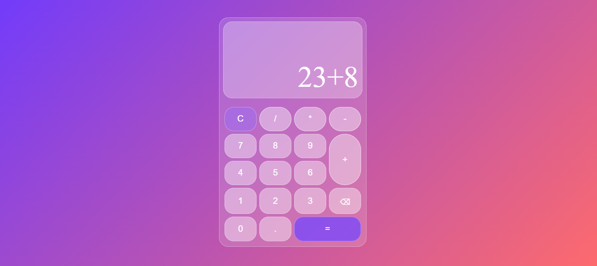

# Calculator

A clean, responsive calculator built with vanilla JavaScript, HTML and CSS.

## 🔗 Live Demo
[View it live](https://miriamromeromon.github.io/Calculator/)

## ✨ Features
- Addition, subtraction, multiplication and division
- Decimal number support
- Keyboard input support
- Division by zero handling
- Backspace and clear buttons

## 🛠️ Built With
- HTML
- CSS
- JavaScript (vanilla)

## 🚀 Getting Started
Clone the repo and open `index.html` in your browser — no dependencies needed.
